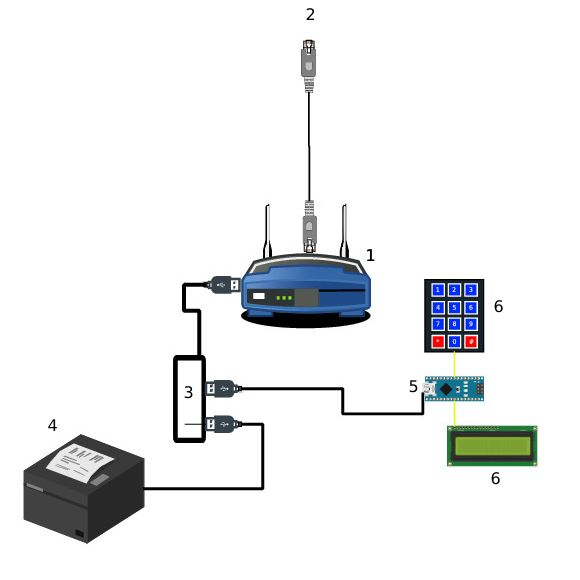

# (Not so in-)secure Access Point

## Motivation

There are wireless access point that give access to the internet everywhere: bars, libraries, civic centers, malls...

Most of them offer either WPA2-PSK encryption (whose security relies on a pre-shared key, common to all the users of the network) or no encryption at all. This means that the traffic of a user can be seen (and what is worse: tampered with) by any other user.

On the other hand, WPA2-Enterprise standard (which is widely supprted by every modern OS) could provide the required security for this kind of settings. But since it requires a complicated infrastructure (some mechanism to provide the user credentials, a radius server...) it is rarely used in these scenarios.

This project aims to help closing this gap, by providing an affordable easy to deploy and easy to use solution.

The main idea is to have a properly configured wifi access point, a ticket printer and a user interface that consists on a lcd screen and a keypad. Each time a user wants to connect, the person in charge of delivering the credentials types the expected duration (can be minutes, hours, days or even permanent) and a ticket with the credentials is printed. Then the user can just use those credentials to connect. The fact that each user will use a different password prevents other users to eavesdrop or tamper with his connection.

## Overview

The basic idea of the design is the following:

1. A router running a custom OpenWRT OS, that will provide the wifi network.
2. A device that provides access to the internet (typically a DSL or Cable Router/Modem), connected to (1) by ethernet cable.
3. A USB hub, connected to (1)
4. A Ticket printer, connected by USB to (3)
5. An arduino nano board, connected by USB to (3)
6. A Keypad and LCD, connected to the pins of (5)

The router (1) will take care of the radius server and the wifi access. It will get the input from the arduino board, create random credentials on demand, and send them to the printer.

## Used hardware

In principle any OpenWRT compatible router with enough RAM, and a compatible USB ticket printer could work. We used in particular a [GL-MT300A-Ext](http://www.gl-inet.com/product/gl-mt300a-ext/) router and a [Floureon ZJ-5890T](https://www.amazon.es/Floureon-ZJ-5890T-Impresora-Billetes-Conpartible/dp/B00NQNH8R6) printer.

In particular, we used a Floureon ZJ-5890T

## Quick setup

These are the steps you need to follow to have a quick setup. First you need the following materials:

- [GL-MT300A-Ext](http://www.gl-inet.com/product/gl-mt300a-ext/) router
- [Floureon ZJ-5890T](https://www.amazon.es/Floureon-ZJ-5890T-Impresora-Billetes-Conpartible/dp/B00NQNH8R6) printer
- USB hub
- An arduino nano board (or compatible)
- A 16x2 LCD display with I2C interface (it should be possible to get rid of the I2C adaptor, but then you might need to adapt the arduino firmware
- A 12 (or 16) keys numeric keypad for arduino.

### Setting up the router.

- Connect the WAN connector of the GL-MT300A-Ext router to the device that will provide you with internet access (usually, your current router)
- Power on the router
- Connect your computer to the LAN connector of the GL-MT300A-Ext router, open a browser and go to the address 192.168.8.1
- Log in with the admin password "goodlife"
- Go to the "firmware" section of the control pannel, select the option to upgrade
- Upload the file `/openwrt/openwrt-ramips-mt7620-gl-mt300a-squashfs-sysupgrade.bin` and proceed with the flashing

Now your router is flashed with the custom version of openwrt, configured to handle the WPA2Enterprise network, and the ticket printing system.

By default it will create a wireless network called SecureAP. You can change it by connecting to it and accessing the control pannel just as you did before. The control pannel will look different than before, but the name of the network is the first option that you will see.

### Setting up the arduino board

To load the firmware to the arduino board you need the arduino IDE installed. The steps to follow are the following:

- Connect the arduino board to your computer by USB
- Open the arduino IDE (make sure that you have the FaBoLCD and Keypad libraries
- Load the File /arduino/controller.ino
- Click on the "upload" button. The firmware will be compiled and uploaded to the board.

We also have to connect the display and keypad. It is done as follows:

- Connect the GND connector of the I2C controller in the LCD display to the GND pin in the arduino board.
- Connect the VCC connector of the I2C controller in the LCD display to the 5V pin in the arduino board.
- Connect the SDA connector of the I2C controller in the LCD display to the A4 pin in the arduino board.
- Connect the SCL connector of the I2C controller in the LCD display to the A5 pin in the arduino board.
- Connect the band of the keypad to the connectors D2-D9 of the arduino board.

You might need to regulate the brighntess of the display. There is a regulator for that in the back, use a scredriver to move it until you can see correctly the characters.

### Connecting everything

- Connect the USB hub to the router
- Connect the arduino board to the USB hub
- Connect the ticket printer to the USB hub

Now everything should be ready to go (maybe you might need to restart the router).

## To do

- Configure restrictive firewall
- Block access to global ip

