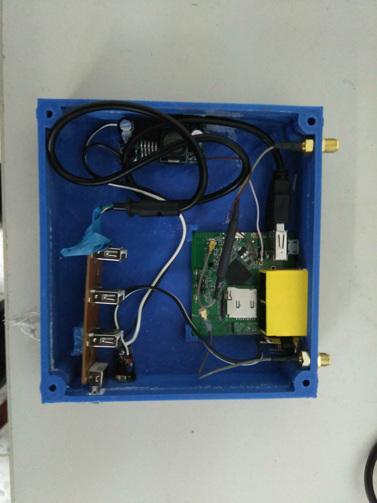
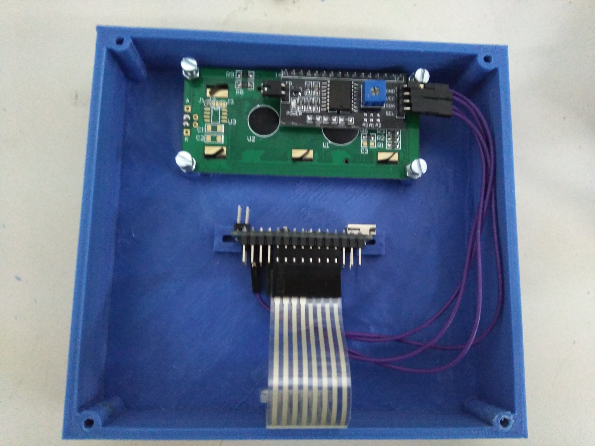
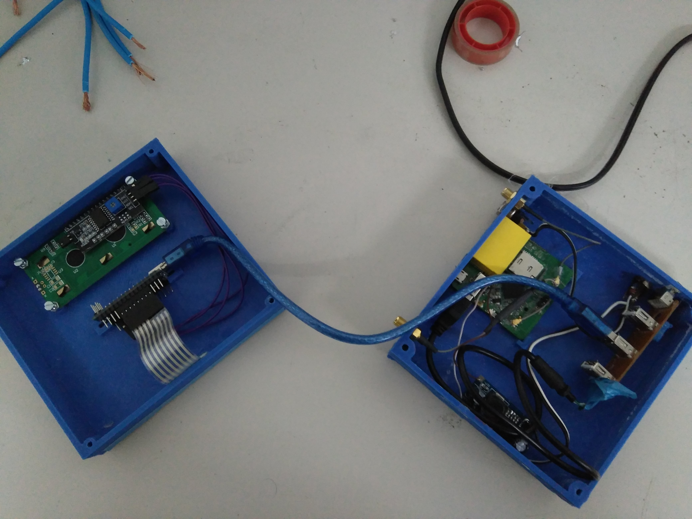

# 3D printed case

Here is the design of a 3D printed case for the router board (it can be taken out of its case), arduino board, display, keypad and usb hub.

There are some differences between this design and the basic one. Most of the are related to the idea of avoiding using two power sources (one for the printer and another for the router). This is achieved by using a voltage regulator that converts 12V to 5V. This way, we have a two female power jack connectors in the case. One of them is meant to be connected to the printer opower source. It is connected to the other one (which will be connected by a male-male power jack cable to the printer) and to the voltage regulator. The voltage regulator is soldered to the GND and 5V pins in the board of the router.

These pictures show the setup:

